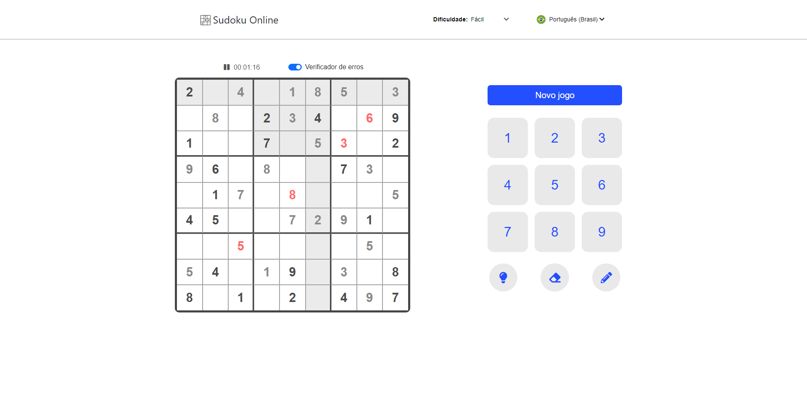

## Sudoku

Se você quiser ver o projeto funcionando [CLIQUE AQUI](https://caiofaraleski.github.io/Sudoku/).

## Sobre o projeto

O Sudoku é um projeto feito principalmente para desafiar a minha lógica e treina-la, por ser um jogo bem complexo de se fazer.

Ele é simplesmente um jogo de sudoku bem completinho.

Ele faz parte do meu portifólio, fique à vontade para fornecer qualquer feedback que possa contribuir com o projeto, código, estrutura ou algo que possa me tornar um desenvolvedor melhor!😉

Conecte-se comigo no [LinkedIn](https://www.linkedin.com/in/caio-faraleski/).

## Algumas observações

1 - A criação dos jogos por enquanto está sendo feita por um while então demora alguns segundinhos, mas já está sendo aprimorado para n precisar esperar a criação dos jogos.

## Funcionalidades

- Novo Jogo
    - Cria um jogo novo.

- Botões
    - Números
        - Usados para escolher o número de cada quadrado,
    - Dica, apagar e rascunho
        - A dica mostra qual é o número do quadrado selecionado, o apagar apaga o número e o rascunho você pode colocar quais são os possíveis números.

- Dificuldade
    - Pode mudar a dificuldade.
    - Quanto mais difícil, menos números iniciais são dados.

- Estoque
    - Adicione e remova produtos do estoque.
    - Atualize a quantidade de cada produto em estoque.

- Idioma
    - Pode mudar o idioma selecionado.

- Timer e verificador
    - O timer mostra a quanto tempo você está resolvendo o atual jogo e pode ser pauzado.
    - O verificador de erros quando ativado avisa em vermelhor se o número colocado não for o certo.

## Construído com 

- Html
- Css
- JavaScript
- Sass
- Bootstrap